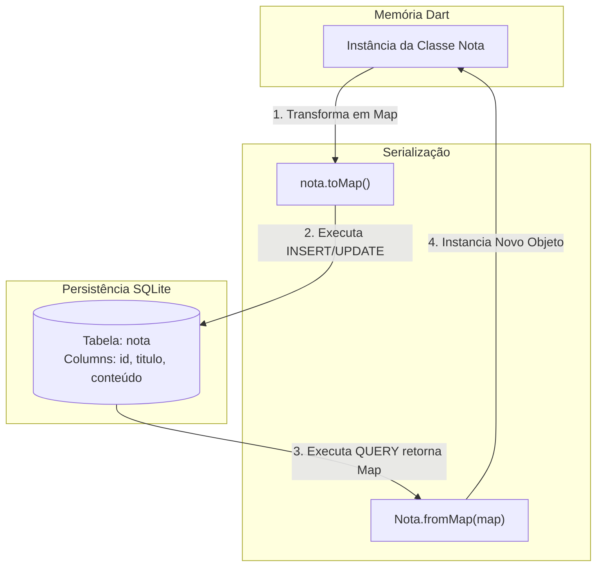

# Documentação de Arquitetura e Modelagem: Módulo de Persistência Local (Armazenamento Local)

Este documento descreve as decisões de modelagem de dados e o fluxo de persistência local utilizando o pacote `sqflite` integrado ao ecossistema flutter.

---

## 1. Mapeamento Objeto-Relacional (ORM)

O `sqflite`se comunica nativamente com dados estruturados na forma de pares de Linha/Coluna (`Map<String, dynamic>`).
Abaixo, o diagrama ilustra o ciclo de vida e a transformação sofrida pelo dado desde a memória da aplicação (Objeto) até o disco de armazenamento (Tabela SQLite).



## Modelagem de Entidde e Relacionamento (MER)
O Banco de dados SQLite armazena a estrutura da tabela utilizando restrições (constraints) e tipos primitivos de dados relacionais

```mermaid

erDiagram
    NOTA{
        INTEGER id PK "AUTOINCREMENT"
        TEXT titulo "NOT NULL"
        TEXT conteudo "NOT NULL"
    }