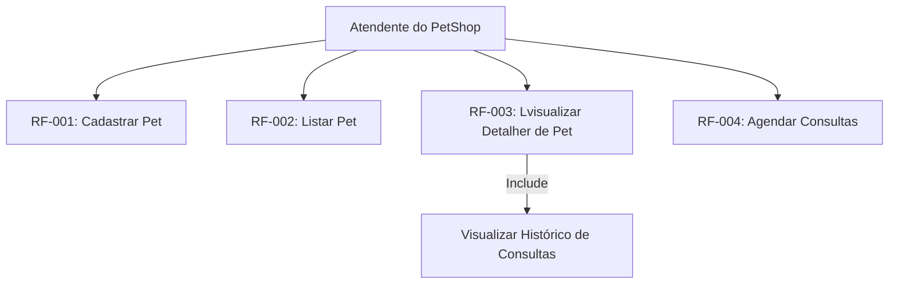
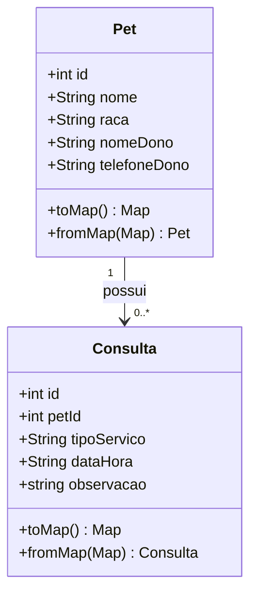

# Documentação de Requisitos de Software (DRS) – App PetShop

**Padrão de Referência:** ISO/IEC/IEEE 29148:2018

**Versão:** 1.0

---

## 1. Introdução

### 1.1 Finalidade

Este documento especifica os requisitos e a arquitetura do aplicativo móvel de Gerenciamento de Consultas de PetShop. O sistema utiliza o framework Flutter para a interface de usuário e lógica de controle, e o banco de dados SQLite para persistência local de dados.

### 1.2 Escopo do Sistema

O aplicativo destina-se a atendentes e gestores de PetShops. Ele permite o cadastro local de animais de estimação (pets), o registro de seus respectivos donos e o agendamento/histórico de consultas e serviços médicos ou de estética (banho, tosa, consultas veterinárias).

* **O que está no escopo:** Cadastro offline, persistência em banco relacional local (SQLite), validação de formulários, visualização de histórico de consultas por pet.
* **O que está fora de escopo:** Autenticação de usuários (login), sincronização em nuvem (Cloud API), notificações *push* em tempo real e gateway de pagamento.

---

## 2. Descrição Geral

### 2.1 Perspectiva do Produto

O produto opera de forma autônoma (*standalone*) em dispositivos móveis (Android/iOS), sem dependência de servidores externos para o seu funcionamento principal. A arquitetura segue o padrão de responsabilidade segregada em camadas (UI, Controllers, Models, Data Access).

### 2.2 Funções do Produto

* Manter registro de Pets (CRUD).
* Agendar Consultas/Serviços vinculados a um Pet específico.
* Listar Pets cadastrados e filtrar consultas por animal.

### 2.3 Classes e Características dos Usuários

* **Atendente/Veterinário do PetShop:** Usuário com nível básico/intermediário de instrução digital que necessita de agilidade no cadastro de dados à beira-leito ou no balcão de atendimento.

---

## 3. Requisitos do Sistemas

### 3.1 Requisitos Funcionais (RF)

| Identificador | Requisito | Descrição | Prioridade |
| --- | --- | --- | --- |
| **RF-001** | Cadastrar Pet | O sistema deve permitir a inserção de um novo pet contendo: nome, raça, nome do dono e telefone do dono. | Essencial |
| **RF-002** | Listar Pets | A tela inicial do sistema deve exibir uma listagem de todos os pets armazenados em ordem alfabética. | Essencial |
| **RF-003** | Visualizar Detalhes | O sistema deve exibir o perfil detalhado do Pet selecionado, incluindo a lista cronológica de suas consultas. | Essencial |
| **RF-004** | Agendar Consulta | O sistema deve permitir o agendamento de uma consulta vinculada a um pet, informando: tipo de serviço, data/hora e observações. | Essencial |
| **RF-005** | Persistência Local | O sistema deve salvar todas as alterações de forma permanente no banco de dados SQLite interno do aparelho. | Essencial |

### 3.2 Requisitos Não-Funcionais (RNF)

| Identificador | Requisito | Descrição | Categoria |
| --- | --- | --- | --- |
| **RNF-001** | Portabilidade | O aplicativo deve rodar em sistemas operacionais Android (versão 8.0 ou superior) e iOS (versão 13 ou superior). | Portabilidade |
| **RNF-002** | Desempenho | O tempo de carregamento da lista de pets e consultas locais não deve exceder 2 segundos. | Eficiência |
| **RNF-003** | Disponibilidade | O aplicativo deve funcionar 100% do tempo em modo offline, sem exigir conexão com a internet. | Confiabilidade |
| **RNF-004** | Arquitetura | O código-fonte deve respeitar a separação em camadas (`lib/models`, `lib/controllers`, `lib/database`, `lib/screens`). | Manutenibilidade |

---

## 4. Diagrams de Engenharia de Software

### 4.1. Diagrama de Casos de Uso

Mostrar o o comportamento so sistema a partir do ponto de vista do usuário (Atendente do PetShop)



### 4.2 Diagrama de Classes

Demonstra as entidades do sistema, sesu atributos, métodos e relacionamentos

Relacionamento entre Pet de Consultas de **1 para muitos (1:N)**



### 4.3. Diagrama de Fluxo (Agenda de Consulta)

Ilustra o fluxo que o usuário percorre, passando pela validação lógica,  até a persistência de dados

``` mermaid

graph LR
    A([Início: Tela de Detalhes do Pet]) --> B[Clicar em 'Agendar Consulta']
    B --> C[Abrir Tela AddConsultaScreen]
    C --> D[Preencher: Serviço, Data/Hora e Obs]
    D --> E{Campos Obrigatórios Preenchidos?}
    E -- Não --> F[Exibir Alerta/Erro na Tela]
    F --> D
    E -- Sim --> G[Acionar ConsultaController.salvar]
    G --> H[Chamar DatabaseHelper.insertConsulta]
    H --> I[Gravar registro na tabela 'consultas' do SQLite]
    I --> J[Exibir Mensagem de Sucesso]
    J --> K[Retornar para a Tela do Pet Atualizada]
    K --> L([Fim])
