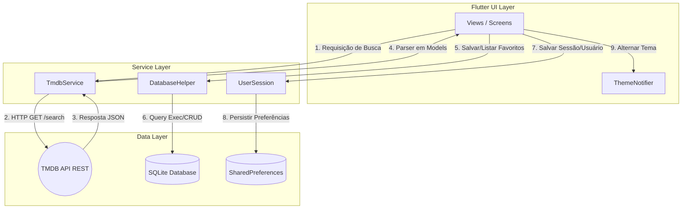
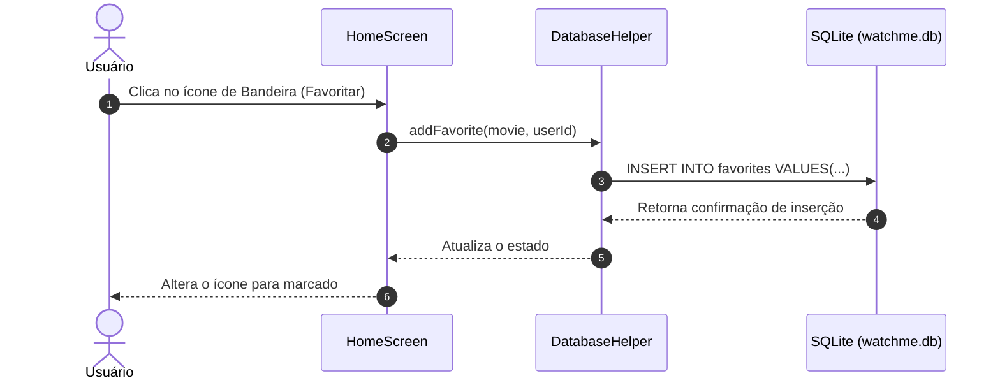

# WatchMe - Seu Diário de Filmes

O **WatchMe** é uma aplicação mobile desenvolvida em Flutter para busca, avaliação e gerenciamento de filmes e séries consumindo a API pública do **TMDB (The Movie Database)** e persistindo dados locais com **SQLite** e **SharedPreferences**.

---

## 🚀 Funcionalidades

* **Catálogo e Busca**: Consulta em tempo real de filmes populares e busca personalizada com tratamento de *query params*.
* **Persistência de Favoritos**: Armazenamento local de dados (ID, título, poster) utilizando banco de dados relacional SQLite.
* **Avaliações Pessoais**: Atribuição de notas (1 a 5 estrelas) e comentários salvos localmente.
* **Gerenciamento de Perfil**: Estatísticas do usuário (quantidade de favoritos e avaliações) e suporte a login/modo visitante.
* **Tema Dinâmico**: Suporte nativo e alternância em tempo real entre modo Claro e Escuro (*Light/Dark Theme*).

---

## 🏗️ Arquitetura do Sistema

O aplicativo segue uma arquitetura baseada no padrão **MVC (Model-View-Controller/Service)** para garantir a separação de responsabilidades.



---

## 📂 Estrutura de Pastas

```text
lib/
├── main.dart                  # Ponto de entrada da aplicação e configuração do ThemeNotifier
├── models/
│   ├── movie.dart             # Modelo de dados de filmes (fromJson / toMap)
│   └── review.dart            # Modelo de dados de avaliações do usuário
├── services/
│   ├── database_helper.dart   # Gerenciador do banco de dados SQLite (Favoritos e Reviews)
│   ├── tmdb_service.dart      # Integração HTTP com a API do TMDB
└── views/
    ├── home_screen.dart         # Grid de filmes, busca e modal de avaliações
    ├── loginChoice_screen.dart  # Tela inicial (Entrar, Criar Conta ou Entrar como Visitante)
    ├── login_screen.dart        # Tela de formulário de login
    ├── profile_screen.dart      # Perfil do usuário com estatísticas, avaliações e favoritos
    └── register_screen.dart     # Tela de cadastro de novos usuários

```

---

## 🛠️ Configuração e Execução

### Pré-requisitos

* **Flutter SDK** `>=3.0.0`
* **Dart SDK** `>=3.0.0`
* Uma chave de API gratuita do [TMDB](https://www.themoviedb.org/)

### Passo a Passo

1. **Clonar o repositório:**

```bash
git clone [https://github.com/spidemyer/mobile/tree/af551c506e2c09d2782dc87e4003e393954117a9/WatchMe/watchme_app]
cd watchme

```

2. **Instalar as dependências:**

```bash
flutter pub get

```

3. **Configurar a chave da API:**
Abra o arquivo `lib/services/tmdb_service.dart` e insira sua chave no campo `_apiKey`:

```dart
static const String _apiKey = 'SUA_CHAVE_TMDB_AQUI';

```

4. **Executar o projeto:**

```bash
flutter run

```

---

## 📊 Fluxo de Dados de Favoritos



```

```